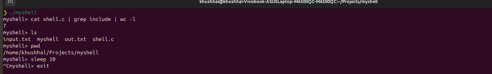

# myshell — a Unix shell built from scratch in C

A custom command-line shell implemented in C using low-level POSIX system calls, without relying on any existing shell libraries. Built to understand process management, file descriptors, and signal handling at the OS level.

## Demo



## Features

- **Command execution** — runs any program available in `$PATH` using `fork()` + `execvp()` + `waitpid()`
- **Built-in commands** — `cd`, `exit` (handled directly in the shell process, not forked, since they need to modify the shell's own state)
- **I/O redirection** — `>` (output redirect), `<` (input redirect), implemented using `open()` and `dup2()`
- **N-way piping** — chain any number of commands together (e.g. `cat shell.c | grep include | wc -l`) by connecting each process's stdout to the next one's stdin via `pipe()` and `dup2()`, generalized to a loop over N commands (not hardcoded to two)
- **Background jobs** — run commands with a trailing `&` to avoid blocking the shell (e.g. `sleep 100 &`)
- **Signal handling** — `Ctrl+C` (`SIGINT`) terminates the foreground child process without killing the shell itself, using `signal(SIGINT, SIG_IGN)` in the parent and `signal(SIGINT, SIG_DFL)` in the child

## Build & Run

```bash
gcc -o myshell shell.c -Wall
./myshell
```

## Example usage

```
myshell> ls -la
myshell> cd Projects
myshell> pwd
myshell> echo hello world > out.txt
myshell> cat < out.txt
myshell> cat shell.c | grep include | wc -l
myshell> sleep 100 &
myshell> exit
```

## Design notes

- **Why `fork()` and `exec()` are separate calls**: Unix splits process creation (`fork`) from program loading (`exec`) so the shell can set up file descriptors, redirection, and environment *before* the new program starts running — the child is still the shell's own process (inheriting its open files and environment) right up until `execvp()` replaces its memory image.
- **Why `cd` must be a built-in**: If `cd` were run via `fork()` + `exec()`, only the child process's working directory would change — the child exits immediately afterward, and the parent shell's directory would remain untouched. `cd` is executed directly in the parent using `chdir()`.
- **Redirection and piping share the same underlying mechanism**: both work by manipulating file descriptor 0/1 (stdin/stdout) with `dup2()` before calling `execvp()`. Redirection points a command's output/input at a file; piping points one command's output at the next command's input.
- **N-way piping generalizes the same pattern**: for N commands there are N-1 pipes; command `i` reads from the previous pipe's read-end (unless it's the first command) and writes to its own pipe's write-end (unless it's the last command).
- **Closing unused pipe ends matters**: after `dup2()`-ing the correct end of a pipe into place, all raw pipe file descriptors are explicitly closed in every child and in the parent. If any process holds an unused write-end open, the reading process never receives EOF and hangs indefinitely waiting for more input.
- **Signal handling is split between parent and child**: since a forked child inherits the parent's signal disposition, the shell sets `SIGINT` to `SIG_IGN` (ignored) so `Ctrl+C` doesn't kill the shell — but each child resets it back to `SIG_DFL` (default) before `exec()`, so the running foreground command can still be interrupted normally.
- **Background jobs skip `waitpid()`**: when a command ends in `&`, the parent doesn't block waiting for it — it prints the child's PID and immediately returns to the prompt. The child, if the shell exits before it finishes, is automatically adopted (re-parented) by `init`, which is standard, safe Unix behavior for orphaned processes.

## Known limitations

- Tokenizer splits on whitespace only, so operators and flags must be surrounded by spaces (e.g. `ls>out.txt` or `wc-l` are parsed as single tokens, not as `ls`/`>`/`out.txt` or `wc`/`-l`).
- Background job processes are not automatically reaped via `SIGCHLD`; the shell relies on process orphaning rather than explicit zombie cleanup.
- Piping supports a fixed maximum of 10 chained commands.

## What this project demonstrates

- Process creation and lifecycle management (`fork`, `exec`, `wait`, zombie/orphan processes)
- The file descriptor abstraction underlying redirection and inter-process communication
- Inter-process communication via pipes, generalized across an arbitrary number of processes
- POSIX signal handling and why parent/child signal dispositions differ